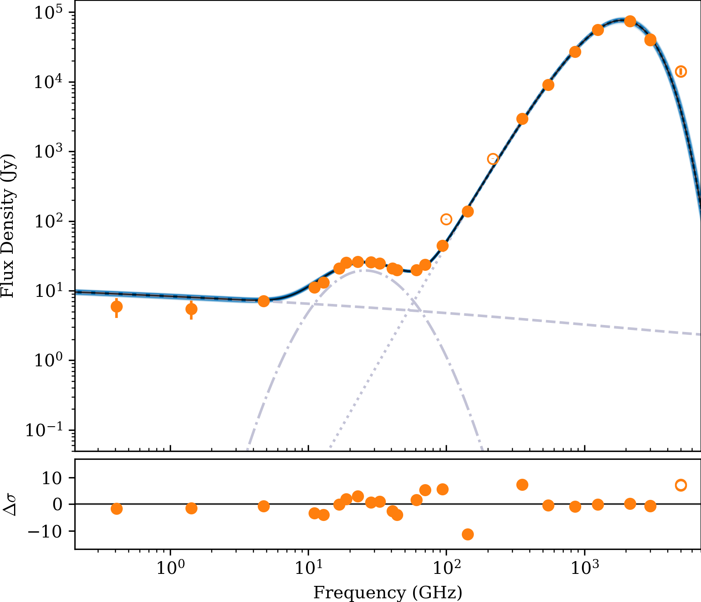

# MCMC Fitter for Spectral Energy Distribution (SED) Models

A Python-based tool for fitting Spectral Energy Distribution (SED) models using Monte Carlo Markov Chains (MCMC). This package uses `emcee` for sampling, includes built-in emission models, and provides utilities for data visualization.

---

## **Overview**

### Main Components:
1. **`mcmc.py`**: The main script to run the MCMC fitting.
2. **`tools.py`**: Contains all utility functions for analysis, plotting, and parameter handling.
3. **`emission.py`**: Houses models for different emission mechanisms such as synchrotron, anomalous microwave emission (AME), thermal dust, and more.

---

## **Dependencies**
This package requires the following Python libraries:
- `emcee`
- `healpy`
- `numpy`
- `datetime`
- `time`
- `sys`
- `inspect`
- `multiprocessing`
- `warnings`
- `lmfit`
- `matplotlib`
- `corner`
- `os`

Install these dependencies using `pip` or `conda`.

---

## **Getting Started**

### 3-Step MCMC Guide

1. **Set Up the Configuration File**:
   - Copy `mcmc_config.py` from the `example_config` directory to your working directory.
   - Modify this dummy configuration file according to your needs.

2. **Import the MCMC Module**:
   Add the path to the MCMC fitter and import it into your script:
   ```python
   import sys
   sys.path.insert(0, "path_to_mcmc_folder")
   import mcmc, emission, tools


3. **Run the MCMC Fitting**

   Use the following syntax to query the program:

   ```python
   mcmc_data, mcmc_model, mcmc_settings = mcmc.mcmc(
       nu,                     # List of frequencies (GHz)
       flux,                   # List of fluxes (Jy)
       flux_err,               # List of flux uncertainties (Jy)
       beam=0.00034421768435898063,  # Beam solid angle (sr)
       excluded=[100, 217, 4997], # Frequencies to exclude (GHz)
       custom_settings=None,   # Optional: custom configuration dictionary
       source_information=None # Optional: additional source-specific metadata
   )
   ```

   - **`nu`**: List of frequencies (in GHz) for your observations.
   - **`flux`**: List of observed fluxes (in Jy) corresponding to the frequencies.
   - **`flux_err`**: List of flux uncertainties (in Jy).
   - **`beam`**: Beam solid angle in steradians, representing the primary aperture.
   - **`excluded`**: List of frequency indices to exclude from the fitting process.
   - **`custom_settings`**: Pass a custom configuration dictionary (overrides the default `mcmc_config.py` settings).
   - **`source_information`**: Pass source-specific metadata (optional).


   The program will automatically:
   1. Validate your input.
   2. Initialize parameter guesses using least-squares fitting (if enabled).
   3. Run the MCMC process with progress updates.
   4. Save the results and plots to the specified directories.
   5. Return fitted data, the model, and settings for further analysis.

   Results will include:
   - Fitted parameter values with uncertainties.
   - Goodness-of-fit statistics (e.g., reduced χ²).
   - Generated figures (SED plot, corner plot, walker plot).


 ---

 ## **Configuration File (`mcmc_config.py`)**

 The configuration file is a Python dictionary with customizable parameters for MCMC settings, plotting, and source-specific options. Below are key sections:

 ### **Fit Settings**
 ```python
 settings = {
     'name': 'MCMC',
     'source_name': None,
     'MCMC': {
         'nwalkers': 230,
         'nsteps': 16000,
         'nburnin': 14000,
         'randomisation': 50,
         'stuck_threshold': 0.001,
     },
     'nthreads': 5,
     'least_sq_prefit': True,
     'components': {'synchrotron': 0,   # synchrotron emission
                    'freefree': 1,      # free-free emission
                    'ame': 1,           # anomalous microwave emission
                    'cmb': 0,           # cmb anisotropies
                    'thermaldust': 1    # thermal dust emission
                   },  # add your own here!
     'priors': {},      # Define parameter priors
     'guesses': {},     # Initial parameter guesses
     'plotting': {
         'resultdir': '/path/to/results',
         'plotSED': True,
         'plotCorner': True,
         'plotWalkers': True,
         'dpi': 300,
     },
     'verbose': True,
     'formatting': {},  # Optional LaTeX formatting for parameters
     'units': {},       # Units of parameters
 }
 ```

 ---

 ## **Output Example**

 When running the program, the terminal output provides detailed information:

 ```
 ************** PRE-FIT INFORMATION **************
 NFREQ = 27, NEXCLUDED = 4, NFREEPARAMS = 7
 NWALKERS = 230, NSTEPS = 6000, NBURNIN = 4000
 NTHREADS = 5, PREFIT_USING_LEAST_SQ = TRUE
 COMPONENTS = FREEFREE(x1) AME(x1) THERMALDUST(x1)

 *************** LEAST-SQUARES INFO **************
 Successfully initialized guesses in 0.0 seconds!

 ************** POST-FIT INFORMATION *************
 ACCEPTANCE = 47.0%, MCMC_TIME = 46.6s [34 us/step]
 WALKERS_KEPT = 228/230 [99.1%], RED_CHI_SQ = 3.8
 FITTED PARAMETERS =
 |    EM = 48.20 ± 1.55 (3.2%)
 |    A_AME = 19.78 ± 0.32 (1.6%)
 |    nu_AME = 26.16 ± 0.29 (1.1%)
 |    W_AME = 0.52 ± 0.01 (2.5%)
 |    T_d = 20.36 ± 0.45 (2.2%)
 |    tau = -4.46 ± 0.02 (0.5%)
 |    beta = 1.47 ± 0.03 (2.0%)

 ************** PLOTTING INFORMATION *************
 SED_PLOT_SAVED = TRUE, TIME_TAKEN = 1s
 WALKERS_PLOT_SAVED = TRUE, TIME_TAKEN = 8s
 CORNER_PLOT_SAVED = TRUE, TIME_TAKEN = 8s
 Saved in /path/to/results

 ************** RESULTS SAVED! *************
 Saved files as MCMC_<source_name>_<timestamp> in /path/to/results
 Program finished with a runtime of 64s!
 ```

 ---

 ## **Generated Figures**

 Below are example figures generated by the program:

 1. **SED Fit**:
    

 2. **Corner Plot**:
    

 3. **Walker Plot**:
    

 ---

 ## **Emission Models**

  `emission.py` includes several built-in models for different emission mechanisms, each based on specific physical principles. These models can be customized or extended as needed. Below are the details of the implemented emission mechanisms:

  ---

  ### Synchrotron Emission

  Synchrotron radiation arises from relativistic electrons spiraling in magnetic fields. The flux density follows a power-law dependence on frequency:

  $$S(\nu) = A_{\text{sync}} \cdot \nu^{\alpha}$$

  where:
  - $A_{\text{sync}}$: Synchrotron amplitude (Jy)
  - $\nu$: Frequency (GHz)
  - $\alpha$: Spectral index

  ---

  ### Anomalous Microwave Emission (AME)

  #### Log-Normal AME

  AME is modeled as a log-normal distribution:

  $$S(\nu) = A_{\text{AME}} \cdot \exp\left(-\frac{1}{2} \left(\frac{\ln(\nu) - \ln(\nu_{\text{AME}})}{W_{\text{AME}}}\right)^2 \right)$$

  where:
  - $A_{\text{AME}}$: AME amplitude (Jy)
  - $\nu_{\text{AME}}$: Peak frequency (GHz)
  - $W_{\text{AME}}$: Logarithmic width

  #### AME Template

  The AME template uses pre-computed spectral shapes scaled to match the amplitude and peak frequency of the observations. The details of this method depend on external templates and interpolation.

  ---

  ### Free-Free Emission

  Free-free emission, arising from electron-ion interactions, depends on the emission measure ($EM$) and frequency. The optical depth is given by:

  $$\tau_{\text{ff}} = 5.468 \cdot 10^{-2} \cdot T_e^{-1.5} \cdot \nu^{-2} \cdot EM \cdot g_{\text{ff}}$$

  The flux density is then:

  $$S(\nu) = \frac{2 k \cdot \nu^2 \cdot T_{\text{ff}} \cdot \Omega}{c^2} \cdot 10^{26}$$

  where:
  - $T_{\text{ff}} = T_e \cdot (1 - e^{-\tau_{\text{ff}}})$: Free-free brightness temperature (K)
  - $T_e$: Electron temperature, fixed at $7500$ K
  - $EM$: Emission measure (pc cm$^{-6}$)
  - $g_{\text{ff}}$: Gaunt factor
  - $\nu$: Frequency (GHz)
  - $\Omega$: Beam solid angle (sr)

  ---

  ### CMB Emission

  CMB anisotropies are modeled using a blackbody correction factor. The flux density is:

  $$S(\nu) = \frac{2 k \cdot \nu^2 \cdot \Delta T \cdot \Omega}{c^2} \cdot \text{PlanckCorr}(\nu) \cdot 10^{26}$$

  where the Planck correction factor is:

  $$\text{PlanckCorr}(\nu) = \frac{x^2 e^x}{(e^x - 1)^2}, \quad x = \frac{h \nu}{k T_{\text{CMB}}}$$

  and:
  - $\Delta T$: Temperature fluctuation ($\mu$K)
  - $T_{\text{CMB}} = 2.725$: CMB temperature (K)
  - $\nu$: Frequency (GHz)
  - $\Omega$: Beam solid angle (sr)

  ---

  ### Thermal Dust Emission

  Thermal dust emission is modeled using a modified blackbody spectrum:

  $$S(\nu) = \frac{2 h \nu^3}{c^2} \cdot \frac{1}{e^{\frac{h \nu}{k T_d}} - 1} \cdot \tau_{353} \cdot \left(\frac{\nu}{353}\right)^{\beta} \cdot \Omega \cdot 10^{26}$$

  where:
  - $T_d$: Dust temperature (K)
  - $\tau_{353}$: Optical depth at $353$ GHz
  - $\beta$: Dust emissivity index
  - $\nu$: Frequency (GHz)
  - $\Omega$: Beam solid angle (sr)

  ---

  Each emission model is implemented in Python functions within `emission.py`. You can integrate or modify them to suit your specific SED fitting requirements.

   ---

 ## **Utility Functions**

 Located in `tools.py`, these functions handle:
 - Input validation (`check_input`)
 - Parameter extraction (`fetch_sed_parameters`)
 - Model construction (`build_model`)
 - Least-squares initialization (`ls_initialisation`)
 - MCMC fitting (`mcmc_fit`)
 - Results saving and plotting (`save_results`, `plot_sed`, `plot_corner`, `plot_walkers`)

 ---
